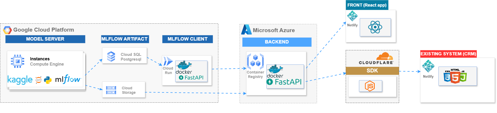

# Prédiction du Diabète - Projet MLOps
Ce projet illustre un pipeline complet d'intégration de modèle de machine learning pour la prédiction du diabète, conçu pour être traçable, modulaire et facilement intégrable dans des environnements existants.
## **Objectifs du Projet**
- Développer un modèle de machine learning pour prédire le diabète.
- Implémenter un pipeline MLOps pour suivre le cycle de vie des modèles.
- Faciliter l’intégration du modèle dans des systèmes tiers grâce à un SDK.
- Fournir une interface utilisateur simple et intuitive pour tester le modèle.
---
## **Structure du Projet**
### 1. **Data Science & Gestion des Modèles**
- **Outils** : Jupyter Notebook, MLflow.
- **Objectif** : Entraîner, évaluer et suivre les versions du modèle.
### 2. **ML Client**
- **Outils** : FastAPI, MLflow Client, Docker.
- **Objectif** : Fournir un service API pour récupérer les modèles en production et effectuer des prédictions.
### 3. **Backend**
- **Outils** : FastAPI, Docker.
- **Objectif** : Interagir avec les données utilisateur et connecter les prédictions du modèle à l'application client.
### 4. **Frontend**
- **Applications** :
  - **React** : Application principale pour la saisie utilisateur.
  - **CRM simplifié** : Simule l'intégration dans un environnement professionnel.
- **Objectif** : Permettre aux utilisateurs finaux de tester les prédictions.
### 5. **SDK**
- **Outils** : Javascript.
- **Objectif** : Simplifier l'intégration des prédictions dans des systèmes tiers.
---
## **Architecture Globale**
Voici un aperçu des composants du projet :
- **Data Science** : Hébergée sur une instance VM GCP avec MLflow et PostgreSQL.
- **Artefacts** : Stockés dans un bucket Google Cloud Storage.
- **ML Client** : Déployé sur Cloud Run (GCP).
- **Backend** : Déployé sur Azure (Azure Web App).
- **Frontend** : Déployé sur Netlify.
- **SDK** : Hébergé sur Cloudflare.
- **CRM simplifié** : Déployé sur Netlify.
---
## **Architecture Globale**
Voici une représentation visuelle de l'architecture globale du projet :


---
## **Installation et Déploiement**
1. Clonez le dépôt :
   ```bash
   git clone https://github.com/Berenger2/mlops_diabete.git
   cd mlops_diabete